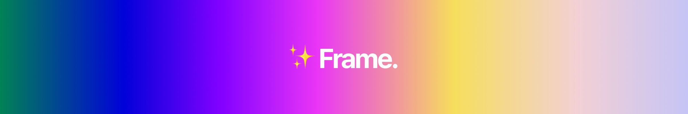
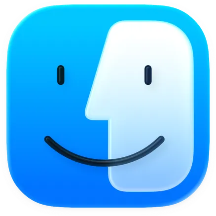
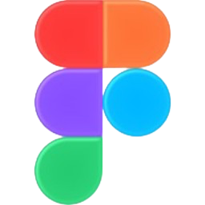

# "Hello, World!" 👋

###  `print("미림마이스터고등학교 뉴미디어소프트웨어과 권율입니다.")`
#### 미림마이스터고에 재학 중이며, 초등학교 저학년부터 이어온 소프트웨어·뉴미디어 콘탠츠·디자인 역량을 깊게 다져가고 있습니다.
##  `/Users/justcallmelight_/Workspace` 

###  `System.out.println(mySW_Stack)`
         
###### `Loading more stacks..`
   

###  `7px #ffffff`
      
